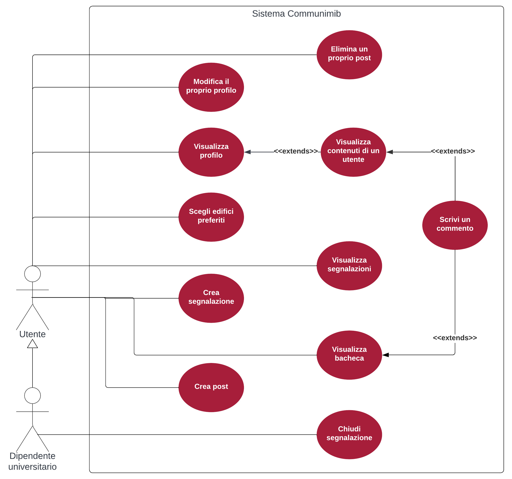
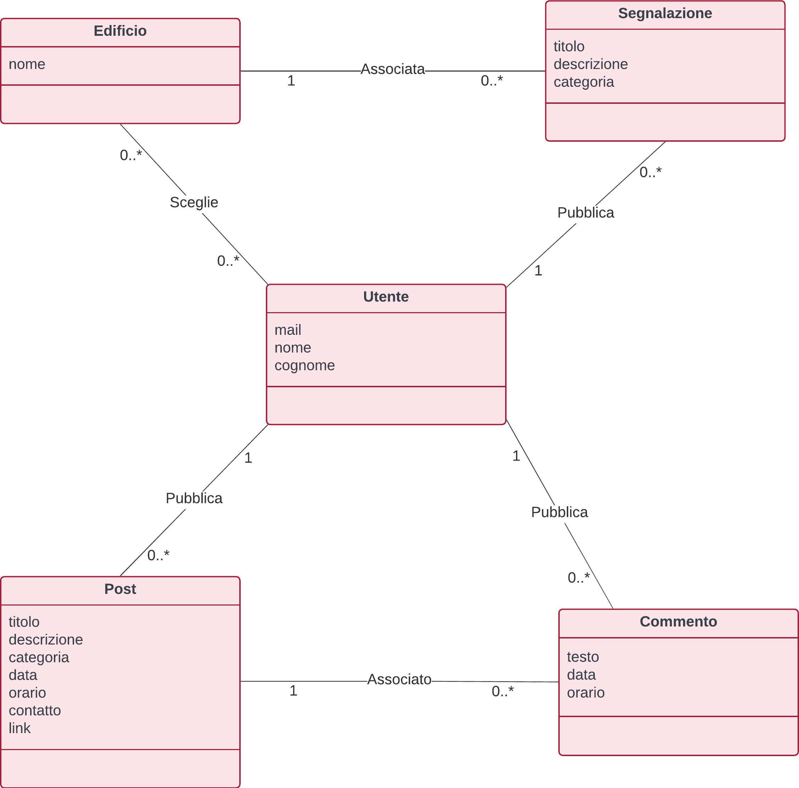
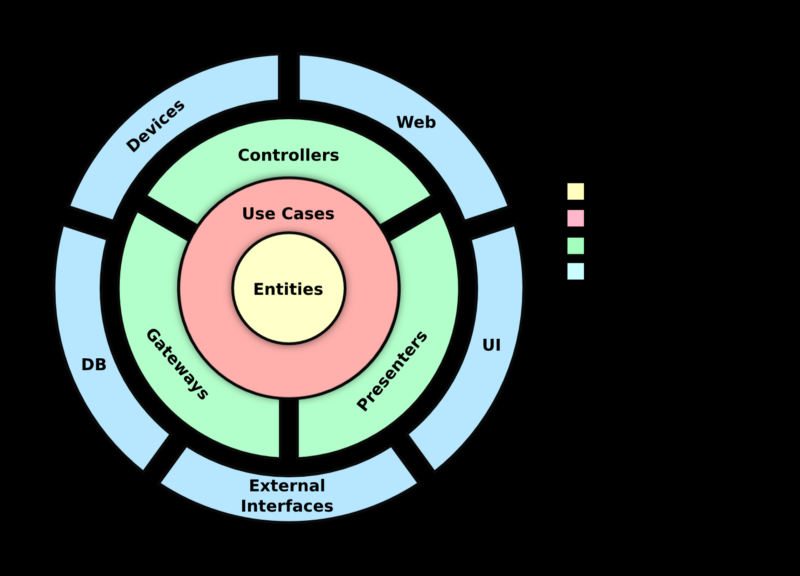
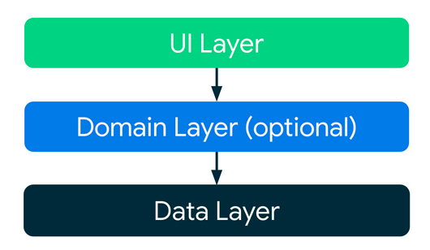

<!-- PROJECT LOGO -->
 

  

# Communimib – Mobile Application

## Overview

Communimib is a mobile application developed within the University of Milano-Bicocca with the goal of improving communication among students, staff, and all individuals who interact daily with the university environment. The app provides two primary features:

* **Issue Reporting System** – to quickly notify malfunctions or problems found in university buildings.
* **University Noticeboard (Bacheca)** – a digital space where users can publish and browse announcements, replacing physical bulletin boards.

This README summarizes the full project development, including requirements analysis, architecture, implementation details, and the use of AI tools such as ChatGPT.

---

## How Communimib Was Born

Communimib arises from the need to enhance communication within the university by providing a fast, centralized, and intuitive tool. Students can report issues such as broken water dispensers or missing classroom material, while the noticeboard allows sharing of announcements related to lessons, events, rentals, private lessons, or lost items.

---

## Use Case Analysis

The design phase began with the definition of detailed use cases to identify all functional aspects of the system.

### Use Case Diagram

Actors include:

* **User** – any student or member of the university who registers with their institutional email.
* **University Staff Member** – a specialized user with additional permissions (e.g., closing reports).

---

## Domain Model

The domain model represents the key entities used in Communimib:

* **User**
* **Post** (Noticeboard)
* **Report** (Issue notification)
* **Comment**
* **Building**

### Diagram

---

## Architecture

Communimib’s software architecture follows **Clean Architecture principles** adapted to modern Android development and uses the **MVVM pattern**.

### Clean Architecture Layers

* **UI Layer** – Activities, Fragments, ViewModels
* **Domain Layer** – contains business logic abstractions
* **Data Layer** – repositories and datasources (local + Firebase)

---

## Firebase Integration

Communimib uses several Firebase services:

* **Firebase Authentication**
* **Realtime Database**
* **Firebase Storage**

---

## Testing Approach

The application includes both unit tests and UI tests to ensure reliable behavior and stability.

---

## Use of ChatGPT During Development

ChatGPT supported multiple development phases including requirement analysis, architecture brainstorming, debugging, and code scaffolding.

---

## Conclusion

Communimib demonstrates how modern architecture, Firebase backend technologies, and AI-assisted workflows can be combined to deliver a scalable, intuitive, and effective app that improves communication across the university community. 

